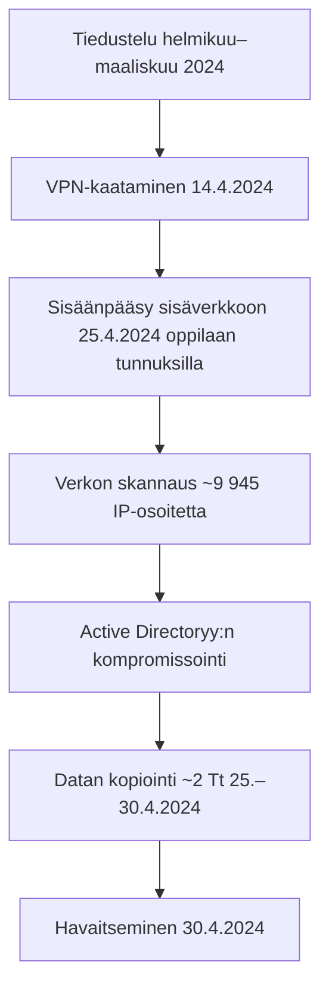

# Helsingin kaupungin tietomurto 2024 - Analyysi
https://turvallisuustutkinta.fi/material/sites/otkes/otkes/hlsztol3t/P2024-01_Helsinki_tutkintaselostus.pdf

## Yleiskuvaus
Helsingin kaupungin kasvatuksen ja koulutuksen toimialaan (KASKO) kohdistunut tietomurto huhtikuussa 2024 on yksi Suomen vakavimmista kyberturvallisuusloukkauksista. Hyökkäys vaaransi noin 300 000 henkilön tiedot ja paljasti merkittäviä puutteita julkisen sektorin kyberturvallisuudessa. Päivitys (18.6.2025): Kohderyhmä laajempi kuin aluksi arvioitu, mukaan lukien kaikki vuosina 2005–2018 syntyneet perusopetusoppilaat ja heidän huoltajansa, yksityiset oppilaitokset, työntekijät, sijaiset, hakijat, urakoitsijat sekä Santahaminan kävijätiedot.

### Aikajana
- **Helmikuu–maaliskuu 2024**: Tiedustelu (yli 300 000 yhteydenottoyritystä VPN-reitittimeen).
- **14.4.2024 klo 20:14**: VPN-reititin kaatuu haavoittuvuuksien vuoksi.
- **18.4.2024**: Mahdollinen kirjautuminen VPN-reitittimeen.
- **25.4.2024 klo 13:17**: Hyökkäys alkaa; sisäänpääsy sisäverkkoon oppilaan tunnuksilla.
- **25.–30.4.2024**: Verkon skannaus, palvelinten haltuunotto ja datan kopiointi (~2 Tt).
- **30.4.2024 klo 08:55**: Tietomurto havaitaan Teams-keskustelussa.
- **30.4.2024 klo 13:40**: VPN-yhteys katkaistaan.
- **1.5.2024**: Rikosilmoitus poliisille.
- **17.6.2025**: OTKES:n tutkintaselostus julkaistaan.

## Kohde ja laajuus
| Kohde | Helsingin kaupungin kasvatuksen ja koulutuksen toimiala (KASKO) |
|-------|-----------------------------------------------------------------|
| **Uhrit** | ~150 000 oppijaa ja huoltajaa + ~15 000 työntekijää; laajempi ryhmä sisältää yksityiset oppilaitokset, sijaiset, hakijat, urakoitsijat ja Santahaminan kävijät |
| **Vuotanut data** | ~2 teratavua (~30 % verkkolevyn sisällöstä) |
| **Tiedostoja** | ~1,3 miljoonaa (joista ~750 000 asiakirjaa) |

## Tekninen toteutus
### Hyökkäysvektori
- **Kohde**: Cisco ASA 5515 VPN-reititin (käyttöönotto 2014, tuki päättynyt 2017).
- **Haavoittuvuus**: Päivittämätön laite; konfiguraatiovirhe (`default-group-policy AC-TUKI` pitäisi olla `DENY`).

### Hyökkäyksen vaiheet

### Käytetyt tekniikat
- **Living Off The Land (LOTL)**: Windowsin omat työkalut.
- **Brute force**: Salasanojen murtaminen pimeästä verkosta ostetuilla tunnuksilla (165 laitetta).
- **Lateral movement**: Verkon sisäinen liikuminen.
- **Privilege escalation**: Admin-oikeuksien saaminen.

## Organisatoriset ongelmat
### Vastuunjaon epäselvyys
- ASA 5515:n vastuusta ei selvyyttä (KASKO ↔ DigiHelsinki).
- Avainhenkilöt poistuneet 2017; dokumentaatio puutteellinen.
- Siirtoprojekti uuteen VPN-järjestelmään kesken vuosia.

### Valvonnan puutteet
- Ei reaaliaikaista tietoturvavalvontaa (lokit puutteellisia, levytila täynnä).
- Palomuurihälytyksiä ei seurattu; tiketti jumissa 4 päivää järjestelmävirheen vuoksi.
- Patch-control puutteellista; vanhentuneet laitteet unohdettu skannauksista.

## Vuotaneet tiedot
### Henkilötiedot
- Oppilaiden henkilötunnukset, osoitteet, terveydentila (esim. allergiat, lääkitykset), äidinkieli, kansalaisuus, uskonto.
- Huoltajien yhteystiedot (ei puhelimia/sähköposteja suojatuille).
- Henkilöstön käyttäjätunnukset, sähköpostit, palkkatiedot.
- Erityiset henkilötiedot (terveys, uskonto, etnisyys).

### Asiakirjatyypit
| Tyyppi | Määrä (arviolta) |
|--------|-----------------|
| Word-dokumentit | ~1 095 000 |
| Excel-taulukot | ~513 000 |
| PDF-tiedostot | ~766 000 |
| PowerPoint-esitykset | ~109 000 |
| **Yhteensä** | ~2 483 000 |

## Taloudelliset vaikutukset
- Välittömät kustannukset (toukokuu–syyskuu 2024): ~650 000 €.
- Uudet tietoturvapalvelut: Vähintään ~400 000 €.
- Muut: Henkilöstön ylitöiden ja järjestelmäkatkojen kustannukset (ei tarkkaa arviota); mahdolliset GDPR-sakot.

## Kriittisimmat opetukset
1. **Teknisen velan hallinta**: Vanhentuneita järjestelmiä ei saa jättää käyttöön; säännölliset päivitykset ja arvioinnit.
2. **Konfiguraationhallinta**: Yksittäinen virhe voi avata koko verkon; säännölliset tarkastukset.
3. **Vastuunjako**: Organisaatiomuutoksissa vastuut selkeiksi; dokumentointi ja tiedonsiirto.
4. **Valvonta**: Reaaliaikainen hälytysvalvonta välttämätön; lokien keskitetty hallinta.
5. **Tiedonhallinta**: Verkkolevyille kertyvät tiedot tarvitsevat säännöllistä siivousta ja klassifiointia.

## Suositukset
### Tekniset toimenpiteet
- Automaattinen patch-hallinta hätäprosesseineen.
- Kattava omaisuusluettelo omistajuusseurannalla.
- Verkon mikrosegmentointi Zero Trust -periaatteella.
- 24/7-valvonta SIEM-ratkaisuilla.
- Monivaiheinen tunnistaminen kaikissa etäyhteyksissä.

### Organisatoriset muutokset
- CISO-roolin perustaminen riittävin valtuuksin.
- Säännölliset riskiarvioinnit ja parannustoimet.
- Henkilöstökoulutus kyberturvallisuudessa.
- Kriisinhallintasuunnitelmat etukäteen hyväksyttyinä.

## Lähteet ja lisätiedot
- [Onnettomuustutkintakeskuksen tutkintaselostus P2024-01](https://turvallisuustutkinta.fi/material/sites/otkes/otkes/hlsztol3t/P2024-01_Helsinki_tutkintaselostus.pdf)
- [Helsingin kaupungin tietomurtosivut](https://www.hel.fi/fi/paatoksenteko-ja-hallinto/tietomurto)
- [Kyberturvallisuuskeskuksen ohjeet](https://www.kyberturvallisuuskeskus.fi/)

## Oikeudellinen kanta
- **Rikosilmoitus**: Tehty 1.5.2024 (törkeä tietomurto).
- **Poliisitutkinta**: Keskusrikospoliisin (KRP) johdolla; esitutkinta käynnissä, Helsingin poliisi tutkii.
- **GDPR-ilmoitus**: Tehty tietosuojavaltuutetulle 30.4.2024.
- **Tutkinta**: OTKES:n tutkinta päättynyt 17.6.2025; ei oikeudellista vastuuta yksilöille. Tietojen väärinkäyttöä ei raportoitu (31.12.2025 mennessä).
