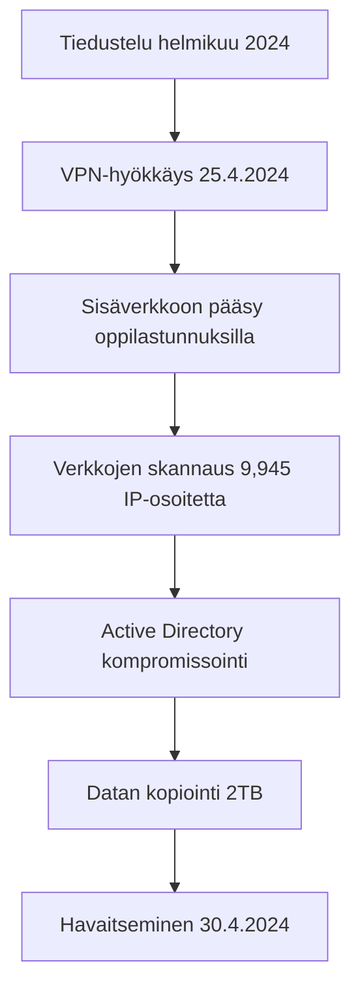

# Helsingin kaupungin tietomurto 2024 - Analyysi

https://turvallisuustutkinta.fi/material/sites/otkes/otkes/hlsztol3t/P2024-01_Helsinki_tutkintaselostus.pdf

## Yleiskuvaus

Helsingin kaupungin kasvatuksen ja koulutuksen toimialaan (KASKO) kohdistunut tietomurto huhtikuussa 2024 on yksi Suomen vakavimmista kyberturvallisuusloukkauksista. Hyökkäys vaaransi noin **300 000 henkilön tiedot** ja paljasti merkittäviä puutteita julkisen sektorin kyberturvallisuudessa.

### Aikajana
- **25.4.2024 klo 13:17** - Hyökkäys alkoi
- **30.4.2024 klo 8:55** - Tietomurto havaittiin
- **30.4.2024 klo 13:40** - VPN-yhteys katkaistiin
- **17.6.2025** - Tutkintaselostus julkaistiin

## Kohde ja laajuus

| Osasto | Helsingin kaupungin kasvatuksen ja koulutuksen toimiala (KASKO) |
|---------|----------------------------------------------------------------|
| **Uhrit** | ~150 000 oppijaa ja heidän huoltajiaan |
| **Henkilöstö** | ~15 000 työntekijää |
| **Vuotanut data** | ~2 teratavua (30% verkkolevyn sisällöstä) |
| **Tiedostoja** | 4,46 miljoonaa tiedostoa |

## Tekninen toteutus

### Hyökkäysvektori
- **Kohde**: Cisco ASA 5515 VPN-reititin (vuodelta 2014)
- **Haavoittuvuus**: Päivittämätön laite, tuki päättynyt 2017
- **Kriittinen virhe**: Konfiguraatio `default-group-policy AC-TUKI` (oikea: `DENY`)

### Hyökkäyksen vaiheet



### Käytetyt tekniikat
- **Living Off The Land (LOTL)** - Windowsin omat työkalut
- **Brute force** - Salasanojen murtaminen
- **Lateraalinen liikkuminen** - Verkon sisäinen leviäminen
- **Oikeuksien eskalointi** - Admin-oikeuksien saaminen

## Organisaatiolliset ongelmat

### Vastuunjaon epäselvyys
- ASA 5515:n vastuusta ei selvyyttä KASKO ↔ DigiHelsinki
- Avainhenkilöt poistuneet 2017, dokumentaatio puutteellinen
- Siirtoprojekti uuteen VPN-järjestelmään kesken vuosia

### Valvonnan puutteet
- Ei reaaliaikaista tietoturvavalvontaa
- Palomuurihälytyksiä ei seurattu
- Tiketti jumissa järjestelmävirheen vuoksi 4 päivää
- Patch-hallinta puutteellista

## Vuotaneet tiedot

### Henkilötiedot
- Oppilaiden henkilötunnukset ja osoitteet
- Huoltajien yhteystiedot
- Henkilöstön käyttäjätunnukset ja sähköpostit
- Erityiset henkilötiedot (terveys, uskonto, etnisyys)

### Asiakirjatyypit
| Tyyppi | Määrä |
|--------|--------|
| Word-dokumentit | 1,094,684 |
| Excel-taulukot | 513,060 |
| PDF-tiedostot | 766,455 |
| PowerPoint-esitykset | 109,378 |
| **Yhteensä** | **2,483,577** |

## Taloudelliset vaikutukset

```
Välittömät kustannukset:     ~650 000€
Uudet tietoturvapalvelut:    ~400 000€
Henkilöstökustannukset:      Ei arvioitu
Järjestelmäkatkot:           Ei arvioitu
GDPR-sakot:                  Mahdollisia
```

## Kriittisimmat opetukset

### 1. Teknisen velan hallinta
- Vanhentuneita järjestelmiä ei saa jättää käyttöön
- Säännöllinen päivitysten arviointi ja toteutus

### 2. Konfiguraationhallinta
- Yksittäinen väärä asetus voi avata koko verkon
- Säännölliset konfiguraatiotarkastukset

### 3. Vastuunjako
- Organisaatiomuutosten yhteydessä vastuut selkeiksi
- Dokumentointi ja tiedonsiirto

### 4. Valvonta
- Reaaliaikainen tietoturvavalvonta välttämätön
- Hälytysten aktiivinen seuranta

### 5. Tiedonhallinta
- Verkkolevyille kertyy tietoja ilman hallintaa
- Säännöllinen tietojen siivous ja klassifiointi

## Suositukset

### Tekniset toimenpiteet
- **Automaattinen patch-hallinta** hätäpäivitysprosesseineen
- **Kattava omaisuusluettelo** omistajuusseurannalla
- **Verkkojen mikrosegmentointi** Zero Trust -periaatteella
- **24/7-valvonta** SIEM-ratkaisuilla
- **Monivaiheinen tunnistaminen** kaikissa etäyhteyksissa

### Organisatoriset muutokset
- **CISO-roolin** perustaminen riittävin valtuuksin
- **Säännölliset riskiarvioinnit** ja parannustoimet
- **Henkilöstökoulutus** kyberturvallisuudessa
- **Kriisinhallintasuunnitelmat** etukäteen hyväksyttyinä


## Lähteet ja lisätiedot

- [Onnettomuustutkintakeskuksen tutkintaselostus P2024-01](https://turvallisuustutkinta.fi/material/sites/otkes/otkes/hlsztol3t/P2024-01_Helsinki_tutkintaselostus.pdf)
- [Helsingin kaupungin tietomurtosivut](https://www.hel.fi/fi/paatoksenteko-ja-hallinto/tietomurto)
- [Kyberturvallisuuskeskuksen ohjeet](https://www.kyberturvallisuuskeskus.fi/)

## Oikeudellinen status

- **Rikosilmoitus**: Tehty 1.5.2024
- **Poliisitutkinta**: Keskusrikospoliisin johdolla (törkeä tietomurto)
- **GDPR-ilmoitus**: Tehty tietosuojavaltuutetulle 30.4.2024
- **Tutkinta**: OTKES:n poikkeuksellinen tutkinta päättynyt 17.6.2025

---


**Tekijä**: -pk Analyysi perustuu OTKES:n viralliseen tutkintaselostukseen  
**Lisenssi**: CC BY 4.0 (tiedot julkisia OTKES:n raportin perusteella)
